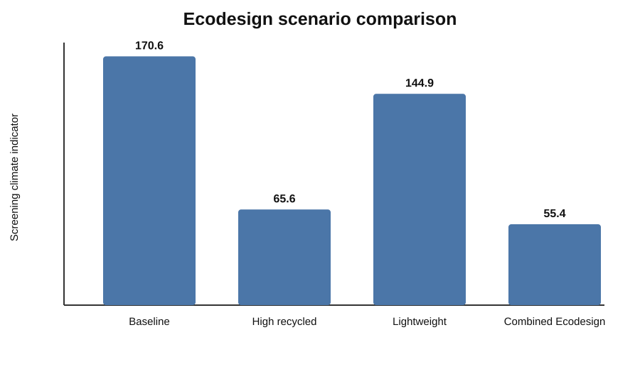
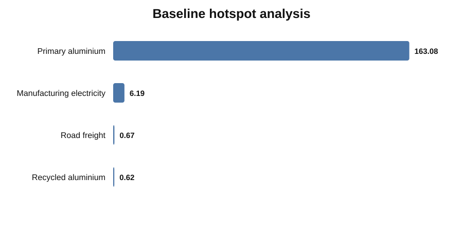
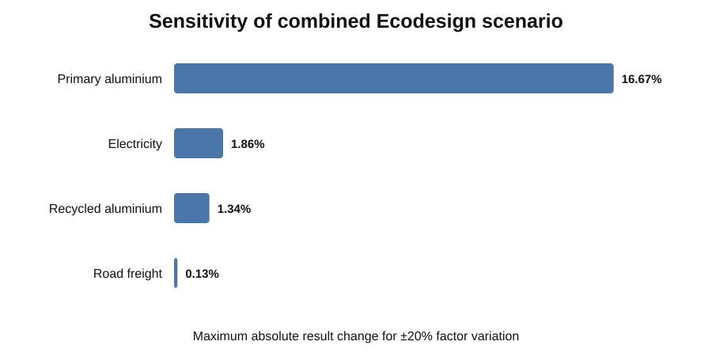

# Aerospace Ecodesign Screening LCA — Python Scenario Tool

A compact Python portfolio project for **Ecodesign and Life Cycle Assessment workflow development**.

The project evaluates a generic aluminium aerospace/avionics enclosure and compares design scenarios using traceable activity data, controlled environmental factors, hotspot analysis, and sensitivity checks.

> **Portfolio scope:** This is a simplified screening LCA, not a certified ISO-conformant study and not suitable for external environmental claims.

## Why I built this

The project demonstrates the kind of technical work required when an LCA tool must be:

- modular and easy to extend
- explicit about assumptions
- reproducible
- traceable to factor sources
- suitable for scenario comparison
- able to identify environmental hotspots
- robust enough for sensitivity checks

It complements my ongoing work on AI-assisted sustainability data extraction by focusing on the deterministic LCA/Ecodesign calculation layer.

## Functional unit

**1 generic aluminium avionics/equipment enclosure**

No proprietary spacecraft, supplier, or company data is used.

## Scenarios

| Scenario | Screening impact | Change vs baseline |
|---|---:|---:|
| Baseline | **170.6** | 0% |
| High recycled content | **65.6** | **61.5% lower** |
| Lightweight design | **144.9** | **15.1% lower** |
| Combined Ecodesign | **55.4** | **67.5% lower** |

Units are a screening climate indicator combining kg CO2e factors with one direct kg CO2 electricity proxy; see the methodology caveat before interpreting totals.

## Main finding

The baseline hotspot is **primary aluminium production**. The combined Ecodesign scenario reduces the screening result by about **67.5%**, mainly through higher recycled content and lower material demand.

That does **not** mean the same reduction would automatically occur in a real spacecraft component. It shows how a transparent Python tool can test design choices and expose which assumptions drive the result.

## Visual results

### Scenario comparison



### Baseline hotspots



### Sensitivity analysis



## Architecture

```text
Scenario assumptions
        ↓
Validated activity data
        ↓
Controlled factor table
(source / year / geography / boundary)
        ↓
Deterministic Python calculations
        ↓
Hotspot analysis
        ↓
Scenario comparison
        ↓
Sensitivity analysis
        ↓
CSV evidence + reproducible figures
```

## Repository structure

```text
.
├── README.md
├── lca_model.py
├── generate_figures.py
├── requirements.txt
├── data/
│   ├── emission_factors.csv
│   └── scenarios.json
├── docs/
│   ├── methodology.md
│   └── assumptions.md
├── results/
│   ├── Executive_Summary.md
│   ├── scenario_results.csv
│   ├── baseline_hotspots.csv
│   ├── sensitivity_results.csv
│   └── factor_evidence.csv
├── figures/
│   ├── scenario_comparison.svg
│   ├── baseline_hotspots.svg
│   └── sensitivity.svg
├── tests/
│   └── test_lca_model.py
└── .github/workflows/
    └── python-tests.yml
```

## Run

```bash
pip install -r requirements.txt
python lca_model.py
python generate_figures.py
pytest -q
```

`lca_model.py` rebuilds the result tables from the scenario assumptions and controlled factor table. `generate_figures.py` then rebuilds the portfolio charts from those result files. GitHub Actions runs the tests, model, figure generation, and script compilation automatically.

## Data provenance

The factor table stores the source, year, geography, unit, and system boundary for every factor.

Public sources used for the screening model:

- **International Aluminium Institute (IAI):** 2022 global primary aluminium carbon footprint of 15.1 t CO2e/t and recycled aluminium production emissions of 0.52 t CO2e/t. [IAI aluminium facts](https://international-aluminium.org/landing/aluminium-facts/)
- **German Environment Agency (Umweltbundesamt):** 2025 direct CO2 factor for electricity consumed in Germany of 344 g CO2/kWh. [UBA 2025 electricity factor](https://www.umweltbundesamt.de/themen/co2-emissionen-pro-kilowattstunde-strom-2025-nur)
- **UK Government / UK ETS analytical example:** 0.07 kg CO2e per tonne-km for HGV freight as a screening proxy. [UK ETS analytical annex](https://www.gov.uk/government/consultations/uk-ets-scope-expansion-ccs-non-pipeline-transport-of-carbon-dioxide/uk-emissions-trading-scheme-uk-ets-non-pipeline-transportation-of-carbon-dioxide-analytical-annex-html)

The different system boundaries are intentionally retained in the evidence table rather than hidden. A real comparative LCA should harmonize them with a consistent LCI/LCIA dataset.

## LCA framework

The project structure follows the logic of ISO 14040/14044:

1. goal and scope
2. inventory
3. impact calculation
4. interpretation

ESA's Clean Space Ecodesign approach similarly uses LCA to identify environmental hotspots and inform design decisions across the space-system lifecycle.

## What I would add next

- more LCIA impact categories
- project-specific material/alloy datasets
- uncertainty distributions / Monte Carlo analysis
- allocation choices for recycled material and end of life
- process-specific manufacturing datasets
- automated report generation
- optional AI agent for data-gap detection, while keeping final calculations deterministic

## Author

**Muhammad Jabran**  
M.Sc. Food System Sciences — University of Bayreuth  
Focus: Bioeconomy, sustainability, data analytics and AI-assisted environmental data workflows
